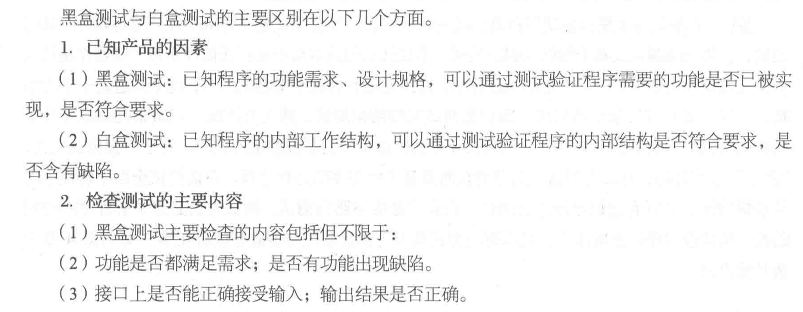
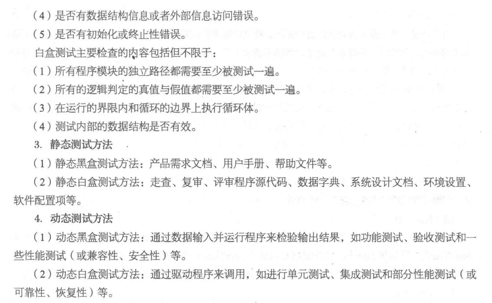
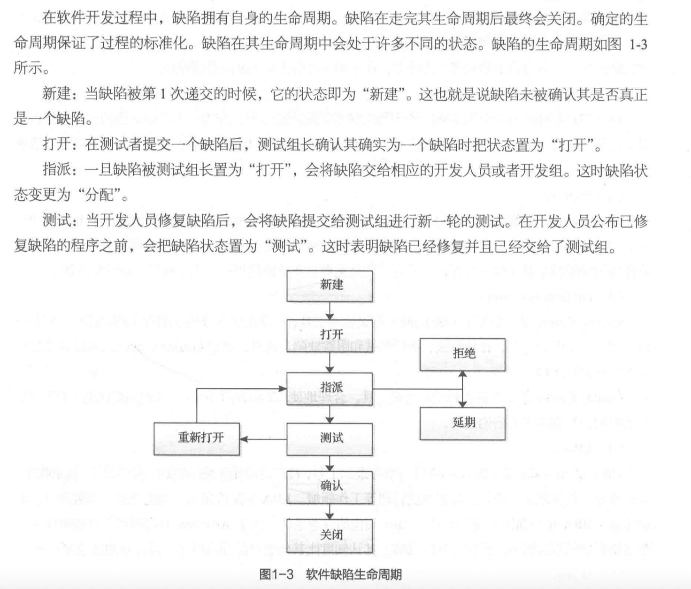
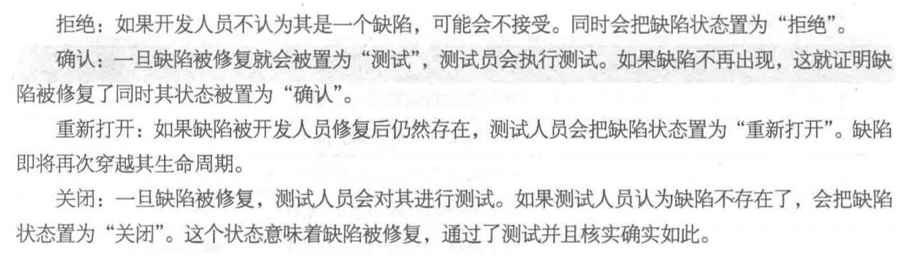
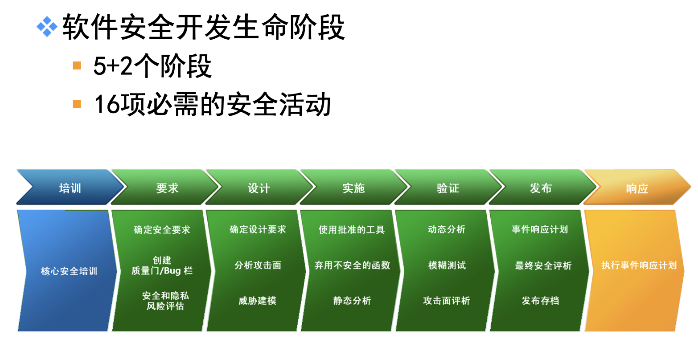

# 软件测试复习题

 

### 1.在软件测试过程中，应该遵循的原则

| 编号 | 原则                                                         |
| ---- | ------------------------------------------------------------ |
| 1    | 完全测试程序是不可能的。                                     |
| 2    | 软件测试是有风险的。                                         |
| 3    | 测试无法显示隐藏的软件故障。                                 |
| 4    | 存在的故障的数量与发现的故障数成正比。                       |
| 5    | 软件测试进行得越多，其程序免疫力就越强。                     |
| 6    | 并非所有的软件故障都能修复。                                 |
| 7    | 一般不要丢弃测试用例。                                       |
| 8    | 应避免测试自己编写的程序。                                   |
| 9    | 软件测试是一项复杂且具有创造性的和需要高度智慧的挑战性任务。 |

 

### 2.测试用例的设计

测试用例：

(1)定义：测试用例指的是在测试执行之前设计的一套详细的测试方案，包括测试环境、测试步骤、测试数据和预期结果。

(2)编写测试用例的唯一标准是用户需求。

(3)必要性：软件测试是有组织性、步骤性和计划性的，为了能将软件测试的行为转换为可管理的、具体量化的模式，需要创建和维护测试用例。

 

测试用例设计相关：

(1)测试用例设计原则

​	①测试用例最小化原则

​	②测试用例替代产品文档功能原则

​	③单次投入成本和多次投入成本原则

​	④测试结果分析和调试最简单化原则

(2)测试用例设计步骤

​	①测试需求分析

​	②业务流程分析	

​	③测试用例设计

​	④测试用例评审

​	⑤测试用例更新完善

### 3.测试用例的原则

设计测试用例的基本原则如下:

| 编号 | 原则                                   |
| ---- | -------------------------------------- |
| 1    | 利用成熟的测试用例设计方法来指导设计。 |
| 2    | 测试用例的针对性。                     |
| 3    | 测试用例的代表性。                     |
| 4    | 测试用例的可判定性。                   |
| 5    | 测试用例的可重现性。                   |
| 6    | 足够详细、准确和清晰的步骤。           |
| 7    | 测试用例必须符合内部的规范的要求。     |

### 4.常用到的软件质量模型

关于软件质量模型，业界已经有很多成熟的模型定义，比较常见的质量模型有 McCall 模型、Boehm 模型、FURPS 模型、Dromey 模型和 ISO9126 模型。

### 5.软件测试计划

软件测试计划是对测试过程的一个整体上的设计。通过收集与项目和产品相关的信息,对测试范围、测试风险进行分析,对测试用例、工作量、资源和时间等进行估算,对测试采用的策略、方法、环境、资源、进度等做出合理的安排。
因此,测试计划的要点包括以下内容。

* 确定测试范围
* 制定测试策略
* 测试资源安排
* 进度安排
* 风险及对策

### 6.制定软件测试的计划的原则

1、制定测试计划应尽早开始

越早制定测试计划，能从最根本的地方去了解被测对象及其内容，方便后续完善。

2、保持测试计划简洁和易读

测试计划应该能够让测试人员清楚自己的任务和工作安排。

3、尽可能争取多渠道评审测试计划

通过团队中的产品、开发等相关负责人进行评审，发现测试计划中的不足与缺陷，能很 好地提升测试计划的质量。

4、计算测试的投入

投入到测试中的项目成本是有限的，在制定测试计划时，一定要注意测试计划的费用情 况，要量力而行。

### 7.制定软件测试的技术的步骤

五个步骤、

计划、准备、检查、修改、继续

### 8.静态测试、动态测试

* 静态测试（static testing）就是不实际运行被测软件，而只是静态地检查程序代码、界面或文档中可能存在的错误的过程。

  包括对代码测试、界面测试和文档测试三个方面。

* 动态测试（dynamic testing），指的是实际运行被测程序，输入相应的测试数据，检查实际输出结果和预期结果是否相符的过程，所以判断一个测试属于动态测试还是静态的，唯一的标准就是看是否运行程序。

### 9.白盒测试、黑盒测试以及二者的关系

* 白盒测试：白盒测试又称结构测试、透明盒测试、逻辑驱动测试或基于代码的测试。白盒测试是一种测试用例设计方法，盒子指的是被测试的软件。对于白盒测试来说，“盒子”是可视的，可以看到盒子内部的东西并且了解程序的运作过程。白盒测试全面了解程序内部逻辑结构、对所有逻辑路径进行测试。白盒法是穷举路径测试，测试人员必须了解程序的内部结构，从检查程序的逻辑出手，从而得出测试数据。

* 黑盒测试：黑盒测试是一-种从软件外部对软件实施的测试，也称功能测试或基于规格说明的测试。黑盒测试的基本观点是:任何程序都可以看作是从输入定义域到输出值域的映射。在测试过程中，因为无法看到盒子里面的内容，也不知道盒子里的结构，所以只关心程序输出的结果。

  测试人员使用黑盒测试方法进行测试时，需要使用的唯一信息就是软件的规格说明。无需考虑程序的内部结构，仅仅靠输入输出之间的关系和程序的功能来设计测试用例，推断测试结果的正确性,以程序的外部特性来判断是否正确运行。由此来看，黑盒测试是从用户观点出发的测试，它需要尽可能地发现程序的外部错误，在已知软件产品功能的基础上进行功能、交互、性能等方面的检测。

* 两者的关系：

  

  

### 10.软件测试与软件开发的过程的关系

* 软件测试和软件开发都是软件过程中的重要活动，是软件生命周期中重要的组成部分，应该是贯穿于整个软件开发生命周期的，测试的尽早介入是软件测试的一个基本准则，而不应仅仅将其看作软件开发中的一个阶段。

* 软件开发是一个自顶向下、逐步细化的过程，而测试过程是依相反顺序自底向上、逐步集成的过程。

* 开发过程中，通过持续的测试可以对产品质量提供持续的、快速的反馈，从而在整个开发过程中不断地、及时地改进产品的质量，并减少各种返工，降低软件开发的成本。

### 11.白盒测试的覆盖准则

白盒测试法的覆盖标准有逻辑覆盖、循环覆盖和基本路径测试。其中逻辑覆盖包括语句覆盖、判定覆盖、条件覆盖、判定/条件覆盖、条件组合覆盖和路径覆盖。六种覆盖标准发现错误的能力呈由弱到强的变化：

1.语句覆盖每条语句至少执行一次。

2.判定覆盖每个判定的每个分支至少执行一次。

3.条件覆盖每个判定的每个条件应取到各种可能的值。

4.判定/条件覆盖同时满足判定覆盖条件覆盖。

5.条件组合覆盖每个判定中各条件的每一种组合至少出现一次。

6.路径覆盖使程序中每一条可能的路径至少执行一次。

### 12.白盒测试的常用工具，各适用于什么

(1) Jtest

是一个代码分析和动态类、组件测试工具，是一个集成的、易于使用和自动化的Java单元测试工具。它增强代码的稳定性，防止软件错误。

(2) Jcontract

Jcontract在系统级验证类/部件是否正确工作并被正确使用。Jcontract 是个独立工具，在功能上是Jtest 的补充。可以用Jcontract插装按DbC注解的Java代码。当您将类/部件组装成系统时，Jcontract 在运行时监视并报告错用和功能性问题。Jcontract 帮助每个开发人员有效地考核类/部件的系统级行为。

(3) C++ Test

C++Test可以帮助开发人员防止软件错误，保证代码的健全性、可靠性、可维护性和可移植性。C++Test自动测试C和C＋＋类、函数或组件，而无需编写单个测试实例、测试驱动程序或桩调用。

(4) CodeWizard

CodeWizard 代码静态分析工具，先进的C/C++源代码分析工具，使用超过500 个编码规范自动化地标明危险的，但是编译器不能检查到的代码结构。

(5) Insure++

Insure++是一个基于C/C++的自动化的内存错误、内存泄漏的精确检测工具。 Insure++能够可视化实时内存操作,准确检测出内存泄漏产生的根源。Insure++还能执行覆盖性分析,清楚地指示那些代码已经测试过。

### 13.单元测试

* 单元测试的原则：

  F-FAST(快速原则)

  单元测试应该是可以快速运行的，在各种测试方法中，单元测试的运行速度是最快的，通常应该在几分钟内运行完毕

  I-Independent(独立原则)

  单元测试应该是可以独立运行的，单元测试用例互相无强依赖，无对外部资源的强依赖

  R-Repeatable(可重复原则)

  单元测试应该可以稳定重复的运行，并且每次运行的结果都是相同的

  S-Self Validating(自我验证原则)

  单元测试应该是用例自动进行验证的，不能依赖人工验证

  T-Timely(及时原则）

  单元测试必须及时的进行编写，更新和维护，以保证用例可以随着业务代码的变化动态的保障质量

  AIR原则

  A-Automatic(自动化原则)

  单元测试应该是自动运行，自动校验，自动给出结果

  I-Independent(独立原则)

  单元测试应该是独立运行，互相之间无依赖，对外部资源无依赖，多次运行之间无依赖

  R-Repeatable(可重复原则)

  单元测试是可重复运行的，每次的结果都稳定可靠

* 单元测试的重要性及目的

  首先保证代码质量。

  其次保证代码的可维护。

  再此保证代码的可扩展。

* 单元测试主要测试问题

  模块接口测试，局部数据结构测试，路径测试，错误处理测试，边界条件测试

### 14.插桩程序设计

是借助往被测程序中插入操作，来实现测试目的的方法。 程序插桩的基本原理是在不破坏被测试程序原有逻辑完整性的前提下，在程序的相应位置上插入一些探针。这些探针本质上就是进行信息采集的代码段，可以是赋值语句或采集覆盖信息的函数调用。通过探针的执行并输出程序的运行特征数据。基于对这些特征数据的分析，揭示程序的内部行为和特征。

### 15.集成测试

* 集成测试的主要任务

  在单元测试的基础上，对单元模块进行组装进行测试。它是为了检测在模块交互中导致模块交互错误的情况。

* 集成测试与单元测试，系统测试的区别

  1、方式不同

  单元测试一般由开发小组采用白盒方式来测试。

  集成测试一般由开发小组采用白盒加黑盒的方式来测试。

  系统测试一般由独立测试小组采用黑盒方式来测试。

  2、粒度不同

  单元测试的粒度最小。

  系统测试的粒度最大。

  集成测试界于单元测试和系统测试之间，起到“桥梁作用”。

  3、内容不同

  单元测试主要测试单元是否符合“设计”。

  集成测试既验证“设计”，又验证“需求”。

  系统测试主要测试系统是否符合“需求规格说明书”。

* 集成测试的内容

  (1)、将各个具有相互调用关系的模块组装起来时，检查穿越模块接口的数据是否会丢失。
  (2)、判断各个子功能组合起来是否能够达到预期要求的父功能。
  (3)、检查一个模块的功能是否对其他模块的功能产生不良影响。
  (4)、检查全局数据结构是否正确，以及在完成模块功能的过程中是否会被异常修改。
  (5)、单个模块的误差累计起来，是否会放大到不可接受的程度。

* 集成测试的方法

  集成测试有两种不同的方法,非增式测试和增式测试。

  * 非增式测试

    * 在配备辅助模块的条件下，对所有模块进行个别的单元测试
      然后在此基础上，按程序结构图将各模块联接起来，把联
      接后的程序当作一个整体进行测试。
    * 典型的测试方法有大爆炸集成测试。
    * 非增式测试的做法是先分散测试,再集中起来一-次完成集成
      测试。如果在模块的接口处存在错误，只会在最后的集成时
      一下子暴露出来,便于找出问题和修改。

  * 增式测试

    增式集成是逐步实现的, 测试过程使用了较少的辅助模块，也就减少了辅助性测试工作。并且一些模块在逐步集成的测试中，得到了较为频繁的考验，因而可能取得较好的测试效果。

### 16.系统测试

* 系统测试与用户测试的区别

  系统测试是将已经继承好的软件系统，作为计算机系统的一个元素，与计算机硬件、某些支持软件、数据和人员等其他系统元素结合在一起，在实际运行环境下，对计算机系统进行一系列的集成测试和确认测试。

  用户测试是让用户帮忙测试

* 系统测试的主要内容

  系统测试是将经过集成测试的软件，作为计算机系统的一个部分，与系统中其他部分结合起来，在实际运行环境下对计算机系统进行的一系列严格有效地测试，以发现软件潜在的问题，保证系统的正常运行。

* 常见的系统测试方法

  比较常见的、典型的系统测试包括恢复测试、安全测试、压力测试。下面对这几种测试进行一一介绍：

  1）恢复测试

  恢复测试作为一种系统测试，主要关注导致软件运行失败的各种条件，并验证其恢复过程能否正确执行。在特定情况下，系统需具备容错能力。另外，系统失效必须在规定时间段内被更正，否则将会导致严重的经济损失。

  2）安全测试

  安全测试用来验证系统内部的保护机制，以防止非法侵入。在安全测试中，测试人员扮演试图侵入系统的角色，采用各种办法试图突破防线。因此系统安全设计的准则是要想方设法使侵入系统所需的代价更加昂贵。

  3）压力测试

  压力测试是指在正常资源下使用异常的访问量、频率或数据量来执行系统。在压力测试中可执行以下测试：

  ①如果平均中断数量是每秒一到两次，那么设计特殊的测试用例产生每秒十次中断。

  ②输入数据量增加一个量级，确定输入功能将如何响应。

  ③在虚拟操作系统下，产生需要最大内存量或其它资源的测试用例，或产生需要过量磁盘存储的数据。

### 17.容量测试与压力测试的区别

容量测试的目的是通过测试预先分析出反映软件系统应用特征的某项指标的极限值，压力测试则是在强负载下查看应用系统在峰值使用情况下操作行为，从而有效地发现系统的某项功能隐患、系统是否具有良好的容错能力和可恢复能力。

### 18.验收测试

* 验收测试的主要内容

  验收测试用来验证系统是否达到了用户需求规格说明书（可能包括项目或产品验收准则）中的要求，测试希望尽可能地发现软件中存留的缺陷，从而为软件进一步改善提供帮助，并保证系统或软件产品最终被用户接受。其主要包括易用性测试、兼容性测试、安装测试、文档（如用户手册、操作手册等）测试等几个方面的内容。

### 19.α 测试和β测试的不同

* 测试时间不同

  alpha测试简称α测试，可以从软件产品编码结束之时开始，或在模块（子系统）测试完成之后开始，也可以在确认测试过程中产品达到一定的稳定和可靠程度之后再开始。

  beta测试是软件产品完成了功能测试和系统测试之后，在产品发布之前所进行的软件测试活动，它是技术测试的最后一个阶段。

* 测试目的

  α测试评价软件产品的功能、可使用性、可靠性、性能和支持，尤其注重产品的界面和特色，即为非正式验收测试。

  beta测试的主要目标是测试可支持性，是一种验收测试，通过了验收测试，产品就会进入发布阶段。

* 测试人员和场所不同

  α测试是由一个用户在开发环境下进行的测试，也可以是公司内部的用户在模拟实际操作环境下进行的受控测试，发现的错误可以在测试现场立刻反馈给开发人员，由开发人员及时分析和处理。不能由程序员或测试员完成。

  beta测试由软件的最终用户们在一个或多个用户的实际使用环境下进行。开发者通常不在beta测试的现场，不能由程序员或测试员完成。

### 20.如何组织软件测试团队

为了实现软件测试管理，需要组成一个专门的测试管理队伍，队伍中的人员都能够胜任其所担任的角色是很重要的。另外，还需确认每种角色的人员应具有必要的权力以完成他们的责任。同时，为了能够获得很高的效率，每个测试管理参与者又都应最大限度地发挥出其最大的技术能力。

### 21.软件测试人员的培养方法

软件测试人员的培养应具备如下素质：

（1） 首先，应对软件测试感兴趣和对自己有自信，如果具备了这两点，那么在开发过程中不管遇到什么样的困难，我相信你一定能克服。  （2） 善于怀疑，世界上没有绝对正确的，总有错误的地方，具有叛逆心理，别人认为不可能发生的事，我却认为可能发生。别人认为是对的，我却认为不是对的。  （3） 打破砂锅问到底的精神，对于只出现过一次的bug，一定找出原因，不解决誓不罢休。  （4） 保持一个良好的心情，否则可能无法把测试作好。不要把生活中的不愉快的情绪带到工作中来。  （5） 做测试时要细心，不是所有的bug都能很容易的找出，一定要细心才能找出这些bug。  （6） 灵活一些，聪明一点，多制造一些容易产生bug的例子。  （7） 在有条件的情况下，多和客户沟通，他们身上有你所需要的。  （8） 设身处地为客户着想，从他们的角度去测试系统。  （9） 不要让程序员，以“这种情况不可能发生”这句话说服你，相反，你应该去说服他，告诉他在客户心里，并不是这样的。  （10） 考虑问题要全面，结合客户的需求、业务的流程、和系统的构架，等多方面考虑问题。  （11） 提出问题不要复杂化，这一点和前面的有点矛盾，如果你是一新手，暂时不要管这一点，因为最终将有你的小组成员讨论解决。  （12） 追求完美，对于新测试员来说，努力的追求完美，这对你很好，尽管有些事无法做到，但你应该去尝试。  （13） 幽默感，能和开发小组很好的沟通是关键，试着给你的开发小组找一个“BUG杀手”，或对他们说“我简直不敢相信，你写的程序居然到现在没有找到BUG”。  （14） 到此是不是对测试很有兴趣呢？不过我要告诉你，测试过程中有酸甜苦辣，其中的滋味只有你知道，也许你会感到枯燥，要学会放松自己，去溜冰或做你喜欢做的事，不过，别放弃，因为你的自信告诉过你“你会是很优秀的测试员”不是吗？

### 22.文档测试主要测试内容

文档测试:测试开发过程中生成的文档，以需求规格说明、软件设计、用户手册、安装手册
等为主，检验文档是否和实际存在差别。文档测试不需要编写测试用例。

### 23.软件测试

这不是这门课吗？？？

### 24.常见的黑盒测试用例的设计方法?并分别简单介绍一下各自的思想。

1）等价类划分： 等价类是指某个输入域的子集合.在该子集合中,各个输入数据对于揭露程序中的错误都是等效的.并合理地假定:测试某等价类的代表值就等于对这一类其它值的测试.因此,可以把全部输入数据合理划分为若干等价类,在每一个等价类中取一个数据作为测试的输入条件,就可以用少量代表性的测试数据.取得较好的测试结果.等价类划分可有两种不同的情况:有效等价类和无效等价类.
2）边界值分析法：是对等价类划分方法的补充。测试工作经验告诉我,大量的错误是发生在输入或输出范围的边界上,而不是发生在输入输出范围的内部.因此针对各种边界情况设计测试用例,可以查出更多的错误.
使用边界值分析方法设计测试用例,首先应确定边界情况.通常输入和输出等价类的边界,就是应着重测试的边界情况.应当选取正好等于,刚刚大于或刚刚小于边界的值作为测试数据,而不是选取等价类中的典型值或任意值作为测试数据.
3）错误猜测法：基于经验和直觉推测程序中所有可能存在的各种错误, 从而有针对性的设计测试用例的方法.
错误推测方法的基本思想: 列举出程序中所有可能有的错误和容易发生错误的特殊情况,根据他们选择测试用例. 例如, 在单元测试时曾列出的许多在模块中常见的错误. 以前产品测试中曾经发现的错误等, 这些就是经验的总结. 还有, 输入数据和输出数据为0的情况. 输入表格为空格或输入表格只有一行. 这些都是容易发生错误的情况. 可选择这些情况下的例子作为测试用例.
4）因果图方法：前面介绍的等价类划分方法和边界值分析方法,都是着重考虑输入条件,但未考虑输入条件之间的联系, 相互组合等. 考虑输入条件之间的相互组合,可能会产生一些新的情况. 但要检查输入条件的组合不是一件容易的事情, 即使把所有输入条件划分成等价类,他们之间的组合情况也相当多. 因此必须考虑采用一种适合于描述对于多种条件的组合,相应产生多个动作的形式来考虑设计测试用例. 这就需要利用因果图（逻辑模型）. 因果图方法最终生成的就是判定表. 它适合于检查程序输入条件的各种组合情况.
5）正交表分析法：可能因为大量的参数的组合而引起测试用例数量上的激增，同时，这些测试用例并没有明显的优先级上的差距，而测试人员又无法完成这么多数量的测试，就可以通过正交表来进行缩减一些用例，从而达到尽量少的用例覆盖尽量大的范围的可能性。
6）场景分析方法：指根据用户场景来模拟用户的操作步骤，这个比较类似因果图，但是可能执行的深度和可行性更好。 
7）状态图法：通过输入条件和系统需求说明得到被测系统的所有状态，通过输入条件和状态得出输出条件；通过输入条件、输出条件和状态得出被测系统的测试用例。
8）大纲法：大纲法是一种着眼于需求的方法，为了列出各种测试条件，就将需求转换为大纲的形式。大纲表示为树状结构，在根和每个叶子结点之间存在唯一的路径。大纲中的每条路径定义了一个特定的输入条件集合，用于定义测试用例。树中叶子的数目或大纲中的路径给出了测试所有功能所需测试用例的大致数量。

### 25.恢复测试

恢复测试:对每一类导致恢复或重构的情况进行测试，验证软件自身运行的回复或重构，软件控制的系统的回复或重构，以及系统控制的软件的回复或重构。

### 26.强度测试

强度测试:使软件在其设计能力的极限状态下，以及超过此极限下运行，检验软件对异常情况的抵抗能力。

### 27.正确性测试

正确性测试就是检查软件的功能是否符合规格说明的测试。

### 28.Web测试

Web系统综合了大量的新技术，诸如HTML、JAVA、JavaScript、 VBScript、 Link 、Database 、Network等，其测试过程也会比较复杂。由于Web应用与用户直接相关，又通常需要承受长时间的大量操作，因此Web项目的功能和性能都必须经过可靠的测试。Web应用的用户群体非常广泛，客户端系统平台和浏览器等也不同，因此还要检测其在不同用户浏览器的显示是否合适。Web应用具有动态性、异构性等特征，因此在对Web应用进行测试时，还需要从最终用户的角度进行安全性和可用性等方面的测试。综上所述，Web系统具有动态性、异构性、并发性和分布性等特征，测试的类型也会比较多。

Web测试的类型包括内容测试、界面测试、功能测试、性能测试、兼容性测试、安全性测试等。

### 29.条件组合覆盖

在白盒测试法中，选择足够的测试用例，使所有判定中各条件判断结果的所有组合至少出现一次，满足这种覆盖标准成为条件组合覆盖。

### 30.软件可靠性

软件可靠性可以定义为软件产品在规定的条件下和规定的时间区间完成规定功能而不发生软件失效的概率。此处的软件失效是指,软件系统表现出与期望不一致的执行行为。

### 31.软件缺陷

软件缺陷常常又被叫作bug。所谓软件缺陷，即计算机软件或程序中存在的某种破坏正常运行能力的问题、错误，或者隐藏的功能缺陷。缺陷的存在会导致软件产品在某种程度上不能满足用，户的需要。IEEE729-1983 对缺陷有一个标准的定义:从产品内部看，缺陷是软件产品开发或维护过程中存在的错误、毛病等各种问题;从产品外部看，缺陷是系统所需要实现的某种功能的失效或违背。

### 32.测试用例

？

### 33.变异测试

变异测试（Mutation Testing）（有时也叫做“变异分析”）是一种在细节方面改进程序源代码的软件测试方法。这些所谓的变异，是基于良好定义的变异操作，这些操作或者是模拟典型应用错误（例如：使用错误的操作符或者变量名字），或者是强制产生有效地测试（例如使得每个表达式都等于0）。目的是帮助测试者发现有效地测试，或者定位测试数据的弱点，或者是在执行中很少（或从不）使用的代码的弱点。

### 34.回归测试

回归测试是指修改了旧代码后，重新进行测试以确认修改没有引入新的错误或导致其他代码产生错误。

### 35.兼容性测试

软件兼容性测试是指检查软件之间能否正确地进行交互和共享信息。随着用户对来自各种类型软件之间共享数据能力和充分利用空间同时执行多个程序能力的要求，测试软件之间能否协作变得越来越重要。软件兼容性测试工作的目标是保证软件按照用户期望的方式进行交互。

### 36.第三方测试

第三方测试有别于开发人员或用户进行的测试，其目的是为了保证测试工作的客观性。从国外的经验来看，测试逐渐由专业的第三方承担。同时第三方测试还可适当兼顾初级监理的功能，其自身具有明显的工程特性，为发展软件工程监理制奠定坚实的基础。第三方测试工程主要包括需求分析审查、设计审查、代码审查、单元测试、功能测试、性能测试、可恢复性测试、资源消耗测试、并发测试、健壮性测试、安全测试、安装配置测试、可移植性测试、文档测试以及最终的验收测试等十余项。

### 37.冒烟测试

冒烟测试的对象是每一个新编译的需要正式测试的软件版本。通过冒烟测试，在软件代码正式编译并交付测试之前，先尽量消除其表面的错误，减少后期测试的负担。冒烟测试的执行者是版本编译人员。

### 38.确认测试

通过集成测试之后，软件已完全组装起来，接口方面的错误也已排除，确认测试即可开始。确认测试应检查软件能否按合同要求进行工作，即是否满足软件需求说明书中的确认标准。

确认测试标准：
实现软件确认要通过一系列黑盒测试。确认测试同样需要制订测试计划和过程，测试计划应规定测试的种类和测试进度，测试过程则定义一些特殊的测试用例，旨在说明软件与需求是否一致。无论是计划还是过程，都应该着重考虑软件是否满足合同规定的所有功能和性能，文档资料是否完整、准确人机界面和其他方面（例如，可移植性、兼容性、错误恢复能力和可维护性等）是否令用户满意。

### 39.性能测试

性能测试: 测试软件是否达到需求规格说明中规定的各类性能指标，并满足相关的约束和限制条件。

性能测试是通过自动化的测试工具模拟多种正常、峰值以及异常负载条件来对系统的各项性能指标进行测试。负载测试和压力测试都属于性能测试，两者可以结合进行。通过负载测试，确定在各种工作负载下系统的性能，目标是测试当负载逐渐增加时，系统各项性能指标的变化情况。压力测试是通过确定一个系统的瓶颈或者不能接受的性能点，来获得系统能提供的最大服务级别的测试。

### 40.压力测试

在软件工程中，压力测试是对系统不断施加压力的测试，是通过确定一个系统的瓶颈或者不能接收的性能点，来获得系统能提供的最大服务级别的测试。例如测试一个 Web 站点在大量的负荷下，何时系统的响应会退化或失败。压力测试注重的是外界的不断施压。

### 41.负载测试

负载测试是模拟实际软件系统所承受的负载条件的系统负荷，通过不断加载（如逐渐增加模拟用户的数量）或其它加载方式来观察不同负载下系统的响应时间和数据吞吐量、系统占用的资源（如CPU、内存）等，以检验系统的行为和特性，以发现系统可能存在的性能瓶颈、内存泄漏、不能实时同步等问题。负载测试更多地体现了一种方法或一种技术。

综上所述，负载测试、压力测试和性能测试的概念可以概括如下：
负载测试是通过改变系统负载方式、增加负载等来发现系统中所存在的性能问题。负载测试是一种测试方法，可以为性能测试、压力测试所采用。负载测试的加载方式也有很多种，可以根据测试需要来选择。
性能测试是为获取或验证系统性能指标而进行测试。多数情况下，性能测试会在不同负载情况下进行。
压力测试通常是在高负载情况下来对系统的稳定性进行测试，更有效地发现系统稳定性的隐患和系统在负载峰值的条件下功能隐患等

### 42.安全测试

安全性测试: 测试软件在没有授权的内部或者外部的用户的攻击或者恶意破坏时如何进行处理，是否能保证软件和数据的安全。

### 43.自动化测试

自动化测试是通过测试工具或其他手段,按照测试工程师的软件自动化测试预定计划对软件产品进行自动化的测试,通俗地说也就是用程序测程序,用脚本的运行代替手工测试。自动化测试是软件测试的一个重要组成部分,它能够完成许多手工测试无法完成的或难以实现的测试工作。

自动化测试优缺点见提纲。

### 44.软件质量保证

软件质量是软件的生命，它直接影响软件的使用和维护。通常软件的质量从以下几个方面评价质量的优劣。
(1)软件需求是衡量软件质量的基础，不符合需求的软件就不具备质量。设计的软件应在功能、性能等方面都符合要求，并能可靠地运行。
(2)软件结构良好，易读、易于理解，并易于修改、维护。
(3)软件系统具有友好的用户界面，便于用户使用。
(4)软件生存周期中各阶段文档齐全、规范，便于配置、管理。

### 45.逻辑覆盖

逻辑覆盖包括语句覆盖、判定覆盖、条件覆盖、判定/条件覆盖、条件组合覆盖和路径覆盖。六种覆盖标准发现错误的能力呈由弱到强的变化：

1.语句覆盖每条语句至少执行一次。

2.判定覆盖每个判定的每个分支至少执行一次。

3.条件覆盖每个判定的每个条件应取到各种可能的值。

4.判定/条件覆盖同时满足判定覆盖条件覆盖。

5.条件组合覆盖每个判定中各条件的每一种组合至少出现一次。

6.路径覆盖使程序中每一条可能的路径至少执行一次。

### 46.SDL

软件安全开发周期(Security Development Lifecycle)
SDL的核心理念就是将软件安全的考虑集成在软件开发的每一个阶段 需求分析、设计、编码、测试和维护。

### 48.模糊测试

模糊测试（Fuzzing），是一种通过向目标系统提供非预期的输入并监视异常结果来发现软件漏洞的方法。

属于黑盒测试：

* 不关心被测试目标的内部实现

* 设计输入，检测结果，发现安全漏洞

步骤：

* 生成大量的畸形数据作为测试用例

* 将这些测试用例作为输入应用于被测对象

* 监测和记录由输入导致的任何崩溃或异常现象

* 查看测试日志，深入分析产生崩溃或异常的原因

### 49.渗透测试

* 通过模拟恶意黑客的攻击方法，来评估系统安全的一种评估方法。

* 从==攻击==的角度测试软件系统是否安全。

* 使用自动化工具或者人工的方法模拟黑客的输入，找出运行时刻目标系统所存在的安全漏洞。

优点: 找出来的问题都是真实的，也是较为严重的

缺点: 只能到达有限的测试点，覆盖率较低

### 50.SBSE

 SBSE（Search-Based Software Engineering）——即基于搜索的软件工程：

 在SBSE（Search-Based Software Engineering ）中，术语“搜索”是指使用的基于元启发式搜索的优化(SBO)技术

SBSE试图将SE问题重新表述为SBO问题(简称“搜索问题”)。

一个搜索问题是在候选解决方案的搜索空间中寻找最优或接近最优的解决方案，由适应度函数指导。

SBSE使用到的技术：
软件的虚拟本质使它非常适合SBO 。这是因为适应性是直接根据工程构件来计算的，不需要对所有其他工程优化方法固有的模拟和建模。SE领域也充满了丰富的度量标准，可以作为适应度函数的初始候选

各种各样的优化和搜索技术可以也已经被使用。最广泛使用的是局部搜索、模拟退火(SA)、遗传算法(GAs)、遗传规划(GP)和爬山(HC)

